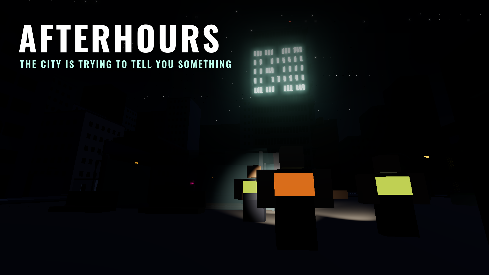

# AFTERHOURS: 03:00

Ett socialt överlevnads- och utforskningsspel för Roblox, skrivet i Luau.

Du är nattkontraktör i Downtown. Klockan går från 00:00 till 03:00 (12 minuter
i verkligheten). Under natten tar du jobb från DISPATCH: laga elskåp, leverera paket,
hämta en skanner i parkeringshuset. Du hittar saker på gatan, och staden reagerar:
strömmen går, larm tjuter, gator spärras. Ibland händer något som inte borde gå.
Pengarna du tjänar är osäkrade tills du lämnar dem på depån. Är du inte tillbaka
före 03:00 förlorar du det du bär på.



## Vad finns i spelet?

**Ett skift**
- **Hub** (40 s) på depån → **natt** 00:00–02:30 → **SHIFT ENDING** 02:30–03:00 → **rapport**.
- **Kontrakt** i tre nivåer: *Safe*, *Normal* och *High Risk*. Högre risk betalar mer.
  9 jobbtyper med flera steg (hämta → leverera, jobba på plats), på platser över hela Downtown.
- **Vändningar** mitt i jobb: *SOMETHING INSIDE* (ljuset tänds i ett rum, och du väljer vad du gör),
  *OVERLOAD* och *WRONG ADDRESS*.
- **Säkra lönen** i depåns lastkaj. Allt du bär och alla avslutade jobb är osäkrade tills dess.
- **Skiftrapporten** ("AFTERHOURS REPORT") berättar vad som hände: jobb, risknivå,
  nattens största händelse, pengarna rad för rad och bästa fynd.

**HEAT och IncidentDirector**
- **HEAT** (0–100, *CALM* → *CRITICAL*) stiger när du tar risker: high risk-jobb,
  avspärrade områden, larm, sällsynta fynd. Den sjunker långsamt i säkra zoner.
- **IncidentDirector** läser av serverns HEAT och väljer händelser med vikter efter
  sällsynthet (Common → Legendary). Den har nedkylning, undviker upprepningar och ger
  alltid en lätt första händelse efter 2,5–3,5 minuter. Varje val loggas med frö
  (`[Director] START ... seed=...`) så att man kan felsöka.
- **10 incidenter:** BLACKOUT, FALSE ALARM, EMERGENCY SHIFT, SILENT CITY, CLOSED STATION,
  THE FOLLOWER, UNKNOWN PACKAGE, LOCKDOWN, CASCADE FAILURE och den legendariska
  **THE OTHER LIGHTS**. Då släcks hela staden utom Calloway Residences, där fönstren
  lyser "03:00", och maskinrummet på taket öppnas.

**Föremål, progression och det sociala**
- 14 föremål i 6 sällsyntheter (Common → Legendary + *???*) med samlingar och små berättelser.
- **Rykte och nivåer** (6 nivåer) låser upp licenser: High Risk-jobb, fler inventarieplatser
  och en skanner. Inget gör dig "starkare".
- **Titlar** över huvudet (NIGHT RUNNER, BLACKOUT SURVIVOR, LAST ONE OUT, 03:00 ...).
- **Upptäckter:** perrongen, taket på tornet, toppen av lyftkranen, med flera, varav några hemliga.
- **Lag** (upp till 4): gemensam bonus vid hemkomst, lagstatus, pingar och konturer.
- **Förrådet (LOCKER)**: ficklampsfärger, västar och inventarieutökningar, för krediter
  från spelet. Inga Robux och inget pay-to-win.
- **Stadens hemlighet:** en veckokod som står i symboler på stationen. Nyckeln till symbolerna
  är utspridd på affischer i staden. Rätt kod öppnar Maintenance B-7.
- **NPC:er** som går omkring, reagerar på incidenter, och ett par som man kan prata med.

**Teknik**
- **Servern bestämmer allt** (pengar, föremål, HEAT, tillträde). Klienten visar bara.
  Alla remotes har typkontroll, avståndskontroll och hastighetsbegränsning, och misstänkt
  beteende loggas utan att straffa.
- **Säker sparning:** DataStore med sessionslås, autosparning, nya försök, schemaversion
  med migreringar. Kan profilen inte laddas spelar man ändå, men inget sparas (och det syns).
- **Datadrivet:** jobb, incidenter, föremål, priser och nivåer ligger i konfigurationsfiler.
- **Analys** via AnalyticsService: introduktionssteg, ekonomi och egna händelser.
- **Mobil först:** minimal HUD som skalas efter skärmen, knappar som placeras ovanför
  Roblox hoppknapp, stöd för handkontroll. StreamingEnabled är på.

## Kontroller

| Handling          | Dator            | Handkontroll | Mobil                 |
| ----------------- | ---------------- | ------------ | --------------------- |
| Använda/jobba     | E (håll)         | X            | Tryck på prompten     |
| DISPATCH          | Tab              | View/Back    | DISPATCH-knappen      |
| Springa           | Shift (håll)     | L3           | SPRINT                |
| Ficklampa         | F                | Y            | LIGHT                 |
| Skanner (nivå 4)  | Q                | DPad upp     | SCAN                  |
| Pinga för laget   | Z / mittenknapp  | DPad höger   | PING                  |
| Välj fack         | 1–9              | L1 / R1      | Tryck på facket       |
| Släppa föremål    | G                | DPad ned     | DROP                  |
| Testpanel         | F8 (Studio/ägare) | –           | –                     |

## Kom igång

### 1. Verktyg

Samma verktyg som hinderbanan i repots rot. Installera
[Rokit](https://github.com/rojo-rbx/rokit) och kör `rokit install` i repots rot.
Då får du `rojo`, `selene`, `stylua` och `lune`. Installera sedan Rojo-pluginet i
Studio med `rojo plugin install`.

### 2. Öppna spelet i Studio

Kör kommandona från mappen `afterhours/`:

```sh
rojo build -o Afterhours.rbxlx     # bygg en place-fil och öppna den i Studio
# eller, när du utvecklar:
rojo serve                          # och klicka Connect i Rojo-pluginet
```

Staden byggs av kod när servern startar, så den syns först när du trycker **Play**.
För att testa skiftet snabbt: tryck **F8** i Studio, så får du en testpanel där du kan
starta incidenter, hoppa i tiden (`clock 2.4`), ge HEAT, krediter och föremål.

### 3. Spara data

Gå till **Game Settings → Security** och slå på **Enable Studio Access to API Services**
om du vill att profiler sparas när du testar i Studio. I publicerade spel fungerar det
direkt.

### 4. Ljud

Roblox kräver att ljud laddas upp till ditt konto. Färdiga ljud (gjorda med syntes, fria att
använda) finns i [`assets/audio/`](assets/audio):

1. Ladda upp filerna i [Creator Hub](https://create.roblox.com/) (**Creations → Audio**)
   eller i Studio (**Asset Manager → Import**).
2. Kopiera varje ljuds id och klistra in det i
   [`src/shared/Config/AudioConfig.luau`](src/shared/Config/AudioConfig.luau), till exempel
   `id = "rbxassetid://1234567890"`.

Ljud utan id hoppas över, så spelet fungerar utan dem. Allt viktigt visas också i text.
Vill du ändra ljuden: `python3 tools/make_audio.py` (kräver numpy och ffmpeg).

### 5. Ikon och tumnaglar

I [`assets/art/`](assets/art) finns en ikon (`icon_512.png`) och tre tumnaglar i 1920×1080:
tornet under THE OTHER LIGHTS, Downtown en vanlig natt och ett lag under en gatlykta.

## Projektets struktur

```
src/
  shared/                     -> ReplicatedStorage.Shared
    Constants.luau, Remotes.luau
    Config/                     GameConfig, ItemConfig, ProgressionConfig, ShopConfig, AudioConfig
    Logic/ShiftClock.luau       klockan 00:00-03:00
    Util/                       Rng, Format, Signal
  server/                     -> ServerScriptService.Server
    Main.server.luau            startar alla tjänster i rätt ordning
    Config/                     kontrakt, incidenter, loot, distriktet, hemligheten (bara servern)
    Logic/                      ren logik: belöningar, HEAT, inventarie, director, rapporten ...
    Services/                   21 tjänster: Data, Shift, Heat, Contracts, Incidents, Npcs ...
    Incidents/                  en modul per incident och vändning
    World/                      bygger Downtown: gator, hus, landmärken, belysning
  client/                     -> StarterPlayer.StarterPlayerScripts.Client
    Main.client.luau            bygger gränssnittets rot och startar controllers
    Controllers/                HUD, Dispatch, Inventory, Results, Notifications, WorldFx,
                                Audio, Input, Markers, Gates, Prompts, Dialogs, Onboarding, Debug
    UI/                         Theme, Ui, Widgets
tests/                        körs med Lune utanför Roblox
tools/make_audio.py           genererar ljuden
assets/                       ljud, ikon och tumnaglar
```

Tjänsterna på servern har `init(registry)` och `start()` och startas i en fast ordning.
Klienten får sitt tillstånd i sektioner (`profile`, `contract`, `heat`, `inventory` ...)
som servern skickar när något ändrats. Incidenter sätter några få attribut på
ReplicatedStorage (`PowerOut`, `OtherLights`, `RedSky` ...), och klienten ritar om staden lokalt.

## Tester

```sh
lune run tests/run.luau   # 674 tester
selene src                # lint
stylua src tests          # formatering
```

Testerna körs i [Lune](https://lune-org.github.io/docs) med riktiga Roblox-datatyper:

- **logic**: belöningsformeln, HEAT, inventarie, directorns val, migreringar, rapporten och koden.
- **world**: bygger hela staden och kontrollerar att alla platser, dörrar, zoner och
  NPC-vägar finns, att inget står inuti väggar eller i luften, och delbudgeten.
- **server**: startar hela servern med fejkade Roblox-tjänster och spelar ett skift med
  låtsasspelare: jobb, loot, alla incidenter, vändningar, koden, förrådet, lag,
  03:00, sparning och omladdning.
- **client**: startar alla controllers och spelar upp exakt det servern skickade under
  servertestet. Sedan klickas allt i gränssnittet, och testet kontrollerar bland annat att
  tornet ritar "03:00" på alla fyra fasader.

## Ärligt: det här är inte testat i riktiga Roblox

Allt ovan körs utanför Roblox. Det fångar logikfel och körfel, men inte allt. Det här bör du
titta på första gången du spelar i Studio:

- **Fysik och rörelse:** trappor, ramper, stegar på bygget och kranen. Kan man fastna någonstans?
- **Hur gränssnittet ser ut** på riktiga skärmar, särskilt telefoner (och att mobilknapparna
  hamnar ovanför hoppknappen).
- **NPC:ernas utseende och animationer** (de laddas från Roblox och har reservfigurer om det
  inte går).
- **Belysningen**: Future-ljus, bloom och dimma. Ljusstyrkan behöver troligen justeras.
- **Symbolerna** på stationen och affischerna (◇▲☾●✕■◐★✚◆) syns i alla typsnitt.
- **Prestanda** på svaga telefoner: staden har cirka 6 400 delar och 176 ljuskällor.
- **Ljuden:** nivåerna mellan dem är bara uppskattade.

## Färdplan

**Nästa steg (fas 2)**
- Ett andra distrikt (hamnen eller industriområdet) med egna jobb och incidenter.
- Fler vändningar och sällsynta händelser, och veckohändelser med egna regler.
- Globala topplistor (bästa skift, flest upptäckter) med OrderedDataStore.
- Inställningar: mindre blinkande ljus, färgblindläge för HEAT, ljudnivåer.

**Senare (fas 3+)**
- Fler samlingar och berättelser bakom föremålen, och fler hemligheter för hela communityn.
- Privata servrar och "skiftledare" som väljer svårighetsgrad.
- Utseende för Robux, men bara utseende: aldrig fördelar.
- Översättningar (LocalizationTable).
